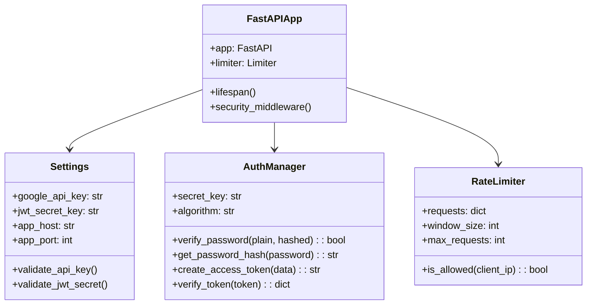
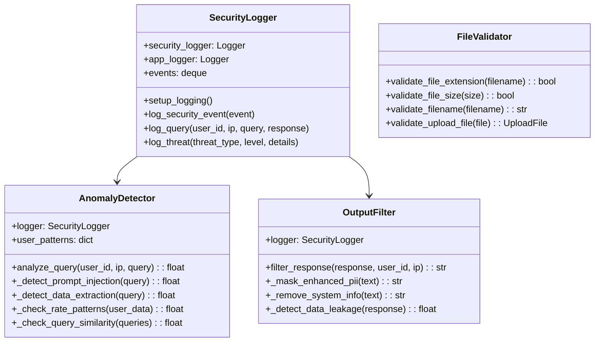
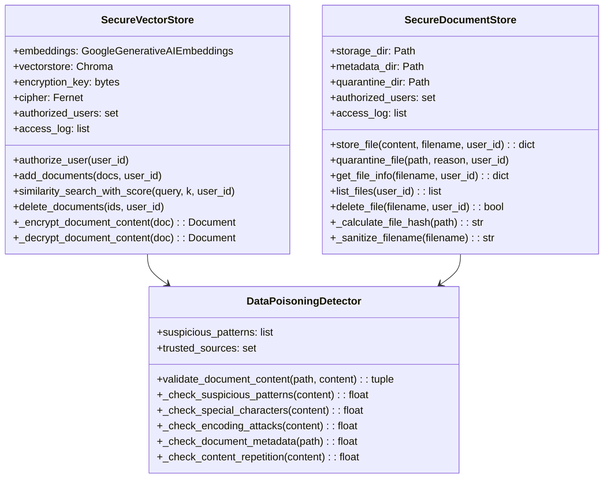
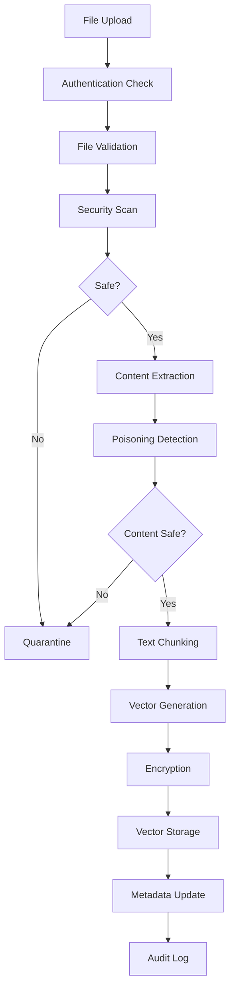
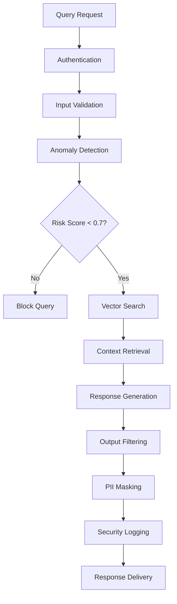

# Secure RAG System - Low-Level Design Documentation

## Table of Contents
1. [System Design Overview](#system-design-overview)
2. [Class Diagrams](#class-diagrams)
3. [Component Specifications](#component-specifications)
4. [Data Models](#data-models)
5. [Security Implementation Details](#security-implementation-details)
6. [Database Schema](#database-schema)
7. [Processing Pipelines](#processing-pipelines)

## System Design Overview

### Design Principles
- **Security by Design**: Every component implements security controls
- **Separation of Concerns**: Clear boundaries between layers
- **Dependency Injection**: Loose coupling between components
- **Event-Driven Architecture**: Comprehensive logging and monitoring
- **Fail-Safe Defaults**: Secure defaults for all configurations

### Architecture Patterns
- **Repository Pattern**: Data access abstraction
- **Middleware Pattern**: Cross-cutting concerns (auth, logging, rate limiting)
- **Strategy Pattern**: Pluggable validation and detection algorithms
- **Observer Pattern**: Security event monitoring and alerting

## Class Diagrams

### Core Application Structure



### Security Layer Architecture



### Data Layer Architecture



## Component Specifications

### 1. Authentication Component (`src/security/auth.py`)

#### AuthManager Class
```python
class AuthManager:
    """Handles authentication and authorization with JWT tokens."""
    
    def __init__(self):
        self.secret_key: str = settings.jwt_secret_key
        self.algorithm: str = settings.jwt_algorithm
        self.access_token_expire_minutes: int = settings.jwt_access_token_expire_minutes
    
    def create_access_token(self, data: Dict[str, Any], expires_delta: Optional[timedelta] = None) -> str:
        """
        Creates JWT access token with user data and expiration.
        
        Args:
            data: User data to encode in token
            expires_delta: Optional custom expiration time
            
        Returns:
            Encoded JWT token string
            
        Security Features:
            - Configurable expiration time
            - Secure secret key validation
            - Timestamp validation (iat, exp)
        """
```

#### RateLimiter Class
```python
class RateLimiter:
    """In-memory rate limiter with sliding window algorithm."""
    
    def __init__(self):
        self.requests: Dict[str, List[datetime]] = {}
        self.window_size: int = settings.rate_limit_window
        self.max_requests: int = settings.rate_limit_requests
    
    def is_allowed(self, client_ip: str) -> bool:
        """
        Checks if request is allowed based on rate limiting rules.
        
        Args:
            client_ip: Client IP address for rate limiting
            
        Returns:
            True if request is allowed, False otherwise
            
        Algorithm:
            1. Remove expired requests from sliding window
            2. Check if current request count < limit
            3. Add current request timestamp
            4. Return decision
        """
```

### 2. Monitoring Component (`src/core/monitoring.py`)

#### SecurityLogger Class
```python
class SecurityLogger:
    """Comprehensive security logging with structured events."""
    
    def __init__(self):
        self.security_logger: logging.Logger
        self.app_logger: logging.Logger
        self.events: deque = deque(maxlen=10000)
    
    def log_security_event(self, event: SecurityEvent):
        """
        Logs security events with threat level classification.
        
        Event Processing:
            1. Add event to in-memory queue
            2. Hash sensitive data (query/response)
            3. Write to security log file
            4. Trigger alerts for high/critical threats
        """
```

#### AnomalyDetector Class
```python
class AnomalyDetector:
    """Real-time anomaly detection for security threats."""
    
    def analyze_query(self, user_id: str, ip_address: str, query: str) -> float:
        """
        Analyzes query for multiple threat vectors and returns risk score.
        
        Detection Algorithms:
            1. Prompt Injection Detection (15+ patterns)
            2. Data Extraction Attempt Detection
            3. Rate Pattern Analysis
            4. Query Similarity Analysis (automated attacks)
            
        Risk Scoring:
            - 0.0-0.3: Low risk (allowed)
            - 0.3-0.7: Medium risk (logged)
            - 0.7-1.0: High risk (blocked)
        """
```

### 3. Data Validation Component (`src/core/data_validation.py`)

#### DataPoisoningDetector Class
```python
class DataPoisoningDetector:
    """Advanced data poisoning detection for uploaded documents."""
    
    def validate_document_content(self, file_path: str, content: str) -> Tuple[bool, float, List[str]]:
        """
        Multi-layer content validation for data poisoning detection.
        
        Validation Layers:
            1. Suspicious Pattern Detection (prompt injection, malicious instructions)
            2. Special Character Analysis (obfuscation detection)
            3. Encoding Attack Detection (Unicode escapes, HTML entities)
            4. Document Metadata Validation
            5. Content Repetition Analysis (spam detection)
            
        Returns:
            - is_safe: Boolean indicating if content is safe
            - risk_score: Float 0.0-1.0 indicating threat level
            - threats: List of detected threat types
        """
```

#### SecureFileValidator Class
```python
class SecureFileValidator:
    """Comprehensive file validation with security focus."""
    
    def validate_file_security(self, file_path: str, content: bytes) -> Tuple[bool, List[str]]:
        """
        Multi-layer file security validation.
        
        Validation Steps:
            1. MIME type validation using magic numbers
            2. File size validation
            3. Executable header detection
            4. Embedded script detection
            5. Suspicious file structure analysis
            
        Security Features:
            - Magic number verification (not just extension)
            - Executable file detection (PE, ELF, Mach-O)
            - Script injection detection in documents
            - PDF/Office macro detection
        """
```

## Data Models

### Security Event Model
```python
@dataclass
class SecurityEvent:
    """Security event data structure for audit logging."""
    timestamp: datetime
    event_type: str  # "query_processed", "threat_detected", "file_uploaded", etc.
    threat_level: ThreatLevel  # LOW, MEDIUM, HIGH, CRITICAL
    user_id: Optional[str]
    ip_address: str
    query: Optional[str]
    response: Optional[str]
    metadata: Dict[str, Any]
    risk_score: float  # 0.0-1.0
```

### File Metadata Model
```python
@dataclass
class FileMetadata:
    """Comprehensive file metadata for security tracking."""
    original_filename: str
    stored_filename: str
    file_size: int
    file_hash: str  # SHA-256
    uploaded_by: str
    upload_timestamp: datetime
    security_validated: bool
    risk_score: float
    mime_type: str
    indexed: bool
    quarantined: bool
    quarantine_reason: Optional[str]
```

### User Context Model
```python
@dataclass
class UserContext:
    """User context from JWT token validation."""
    sub: str  # Username/User ID
    active: bool
    roles: List[str]  # ["admin", "user", "readonly"]
    permissions: List[str]  # ["read", "write", "delete"]
    exp: int  # Expiration timestamp
    iat: int  # Issued at timestamp
```

## Security Implementation Details

### Encryption Implementation

#### Vector Store Encryption
```python
class SecureVectorStore:
    def _encrypt_document_content(self, doc: Document) -> Document:
        """
        Encrypts document content before vector storage.
        
        Process:
            1. Generate Fernet encryption key (stored securely)
            2. Encrypt page_content with AES-256
            3. Store encrypted content in metadata
            4. Replace page_content with hash for indexing
            5. Add encryption metadata
        """
```

#### Key Management
```python
def _get_or_create_encryption_key(self) -> bytes:
    """
    Secure encryption key management.
    
    Security Features:
        - Key stored in secure directory with 600 permissions
        - Automatic key generation if not exists
        - Key rotation capability (future enhancement)
        - Hardware security module support (future)
    """
```

### Input Validation Pipeline

#### Query Validation Flow
```
Raw Query → Length Check → Character Encoding → Pattern Analysis → Sanitization → Risk Scoring
```

#### File Validation Flow
```
Upload → MIME Detection → Size Check → Content Scan → Metadata Analysis → Security Score → Store/Quarantine
```

### Threat Detection Algorithms

#### Prompt Injection Detection
```python
def _detect_prompt_injection(self, query: str) -> float:
    """
    Advanced prompt injection detection using multiple techniques.
    
    Detection Methods:
        1. Pattern Matching: 15+ known injection patterns
        2. Instruction Override Detection: "ignore previous", "forget all"
        3. Role Manipulation: "you are now", "act as"
        4. System Command Injection: "system:", "admin mode"
        5. Special Character Analysis: Excessive brackets, pipes
    """
```

## Database Schema

### Vector Store Schema (ChromaDB)
```json
{
  "collection_name": "secure_rag_collection",
  "metadata": {
    "hnsw:space": "cosine",
    "encrypted": true,
    "created_at": "2024-01-15T10:30:00Z"
  },
  "documents": [
    {
      "id": "doc_uuid",
      "embedding": [0.1, 0.2, ...],
      "metadata": {
        "source": "uploads/document.pdf",
        "encrypted_content": "base64_encrypted_data",
        "is_encrypted": true,
        "encryption_timestamp": "2024-01-15T10:30:00Z",
        "page": 1,
        "chunk_index": 0
      },
      "document": "[ENCRYPTED_CONTENT_hash16]"
    }
  ]
}
```

### File Metadata Schema (JSON)
```json
{
  "original_filename": "research_paper.pdf",
  "stored_filename": "research_paper_20240115_103000.pdf",
  "file_size": 2048576,
  "file_hash": "sha256_hash_here",
  "uploaded_by": "user123",
  "upload_timestamp": "2024-01-15T10:30:00Z",
  "security_validated": true,
  "risk_score": 0.1,
  "mime_type": "application/pdf",
  "indexed": true,
  "quarantined": false,
  "validation_results": {
    "pattern_score": 0.0,
    "encoding_score": 0.0,
    "metadata_score": 0.1,
    "repetition_score": 0.0
  }
}
```

## Processing Pipelines

### Document Processing Pipeline



### Query Processing Pipeline



This low-level design provides the detailed technical specifications needed for implementation, maintenance, and security auditing of the Secure RAG System.
